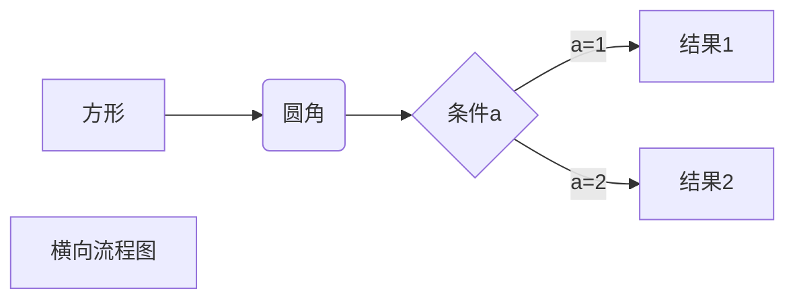

# sdf

## fgsgsdfdg

dghhhgdfg
sfd

|表头|表|
|---|----|
|单元格| 单元格 |
|单元格| 单元格 |


| 单 | 单 | 单 
| :--- | --- | --- 
| 单 | 单 | 单sgs 
| 单 | 单 | 单 



    show engines;


````mysql
show engines;

select * from CHARACTER_SETS;
````


```java

class A { }


```
